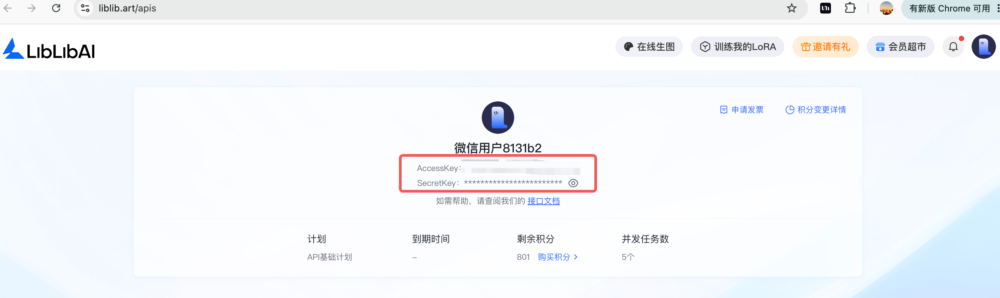
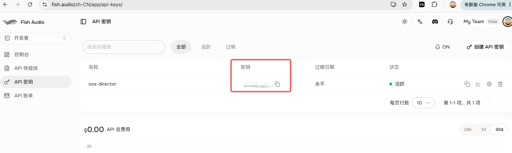

# Vox Agent

用 **Codex GPT Image 2 / Liblib 生图 + Liblib Kling + Fish Audio + 本地 ffmpeg**，把一个主题制作成 VOX 风格的纸张拼贴解说视频。

在 Codex 中，整批关键帧默认使用聊天界面的 GPT Image 2，不需要 OpenAI API Key；manifest 有多少张图片就创建多少个逻辑子代理，每个代理只生成一张并尽可能并行执行。如果任意一张出现网络或服务异常，立即停止未完成的 Codex 生图，并由 Liblib 重新生成这一项目的**全部关键帧**，保证一条视频不混用两种画风。在非 Codex 环境中，全部图片直接由 Liblib 生成。两种环境的视频阶段都使用 Liblib/Kling；Fish Audio `s2.1-pro-free` 负责中文旁白，本地流程负责连续语音、字幕、音乐混音和最终装配。

## 视频样例：秦始皇统一货币

[](./assets/showcase-qin-currency.mp4)

点击预览图播放，或[直接下载 MP4](./assets/showcase-qin-currency.mp4)。

- 主题：秦始皇统一货币
- 规格：中文、16:9、1920×1080、15 秒、24 fps
- 视觉：中式水墨、旧纸、报刊、朱砂印章、考古钱币拼贴
- 关键帧：迁移前样例使用 Liblib Star-3 Alpha（新项目已改为 GPT Image 2）
- 视频生成：Liblib Kling image-to-video
- 配音：Fish Audio `s2.1-pro-free`
- 音色：历史故事·清晰，`reference_id=6fc59d2b56cf402eb572934114c8d8aa`
- 旁白节奏：句间 0.10 秒，自动裁掉 TTS 文件头尾静音

仓库里的这条 MP4 保留作为节奏与成片结构参考；它生成于 GPT Image 2 迁移前。
当前代码会自动识别运行环境，并坚持同一项目的全部关键帧来自同一个生图服务。

## 1. 安装

将仓库克隆到 Codex Skills 目录：

```bash
git clone https://github.com/hongtao520/vox-agent.git ~/.codex/skills/vox-agent
cd ~/.codex/skills/vox-agent
```

本机需要：

- Python 3.9+
- `ffmpeg` 与 `ffprobe`
- Pillow：`python3 -m pip install Pillow`

## 2. 首次使用：提供三个密钥

第一次运行生成流程前，Vox Agent 会检查以下三个密钥；缺少任何一个都会暂停并显示获取地址：

1. `LIBLIB_ACCESS_KEY`
2. `LIBLIB_SECRET_KEY`
3. `FISH_API_KEY`

不要把密钥粘贴到聊天、`beats.json` 或 GitHub。使用下面的配置器，在终端隐藏输入：

运行一次隐藏输入配置器：

```bash
python3 scripts/configure_credentials.py
```

### 获取 Liblib AccessKey 和 SecretKey

登录 [Liblib API 页面](https://www.liblib.art/apis)，在账户卡片中复制 `AccessKey` 和 `SecretKey`：



### 获取 Fish Audio API Key

登录 [Fish Audio API 密钥页面](https://fish.audio/zh-CN/app/api-keys/)，点击“创建 API 密钥”并复制生成的密钥：



密钥保存在 Skill 根目录的 `.env`，权限为 `0600`，并被 `.gitignore` 排除。检查配置时不会显示密钥：

```bash
python3 scripts/configure_credentials.py --check
```

`configure_credentials.py` 只要求这三个密钥。Codex 聊天界面的 GPT Image 2 使用当前 Codex 会话权限，不需要额外的 OpenAI API Key。

## 3. 准备项目

```bash
mkdir -p out/qin-currency-15s/audio
cp examples/qin-currency-15s.beats.json out/qin-currency-15s/beats.json
```

准备一条至少 15 秒的本地背景音乐，并把 `beats.json` 的 `bgm_path` 改为它的绝对路径。音乐应低存在感、无歌词，避免压住旁白。

这个 15 秒样例采用三句话、三个镜头：

1. 七国异币：不同钱币阻碍跨地区流通。
2. 秦半两：统一为圆形方孔的秦半两。
3. 统一尺度：货币连接贸易、税赋与中央权力。

## 4. 生成拼贴关键帧

生成正式图片前，建议先进行视觉风格对比：

```bash
python3 scripts/style_bakeoff.py out/qin-currency-15s chinese-ink,newsprint-editorial,soviet-constructivist
```

Codex 模式同样会先写出 style-bakeoff manifest；生成其中图片后再进行目视选择。

确认风格后准备每个镜头的 GPT Image 2 拼贴关键帧：

```bash
python3 scripts/keyframes.py out/qin-currency-15s
```

建议在 `beats.json` 使用默认配置：

```json
{"image_provider": "auto"}
```

- **Codex 环境**：写出 `keyframes/gpt-image-2-manifest.json`。系统按 manifest 图片数创建同样数量的逻辑子代理，一名代理负责一张图，并把图片保存到对应 `dest`。主代理不再逐张串行生图。若平台并发槽不足，未启动任务会排队，并在槽位释放后立即继续。全部成功后，再次运行相同命令登记路径。
- **非 Codex 环境**：不创建 Codex 生图任务，全部关键帧直接通过 Liblib API 生成。

在 Codex 环境中，只要任意一张图片发生网络或服务错误，就停止后续 Codex 生图，不重试失败图片，并执行：

```bash
python3 scripts/keyframe_fallback.py out/qin-currency-15s --all
```

`--all` 会通过 Liblib 重新生成全部关键帧，并把已成功的 Codex 图片保留在本地但不再用于成片。这样最终视频不会混用 Codex 和 Liblib 两套画风。如果下载后本地后处理意外中断，再次执行相同命令会复用已下载的 Liblib 文件，避免重复提交。

使用 Skill 时这些步骤由 Codex 自己执行；manifest 是 Codex 与本地脚本之间的任务
协议，不是要求用户手工复制提示词。

每个 Codex manifest 都包含 `execution.requested_subagents`，其数值严格等于
`items` 数量，并包含“一代理一图片”的写入范围和失败策略。详细协议见
[`references/codex-parallel-keyframes.md`](./references/codex-parallel-keyframes.md)。

检查重点：

- 是否具有明显的撕纸边缘、纸张阴影、胶带、网点和印刷错位
- 钱币、人物、市场和路线是否是分层剪纸，而不是普通 3D 场景
- 生成画面不要承担准确中文文字；标题和字幕放到本地后期层

## 5. 图生视频

```bash
python3 scripts/clips.py out/qin-currency-15s
```

Liblib Kling 会把每张拼贴海报制作成“活的海报”。`camera_move` 控制整体运镜，`element_motion` 控制钱币、纸片、路线等局部运动。

生成后检查：

- 钱币和人物没有变形
- 纸张仍保持平面拼贴质感
- 相邻镜头运镜没有机械重复
- 临时生成 URL 已及时下载到本地

## 6. 生成 Fish 中文旁白

```bash
python3 scripts/audio.py out/qin-currency-15s
```

样例配置：

```json
{
  "voice": {
    "provider": "fish",
    "model": "s2.1-pro-free",
    "reference_id": "6fc59d2b56cf402eb572934114c8d8aa",
    "speed": 1.0,
    "temperature": 0.65,
    "top_p": 0.7,
    "trim_silence": true
  }
}
```

如果 `beats.json` 没有写 `voice` 且没有提供完整的本地旁白，脚本会自动使用以上“历史故事·清晰”音色作为默认值。

`trim_silence` 只裁剪文件边缘静音，不会删除句子内部的自然停顿。已生成的旁白会复用；如需强制重做，在 `voice` 中临时设置 `"regenerate": true`。

## 7. 连续旁白与音画同步

```json
{
  "narration_timing": {
    "mode": "continuous",
    "gap_s": 0.1,
    "lead_in_s": 0.12,
    "tail_s": 0.5
  }
}
```

`continuous` 模式会：

- 上一句结束约 0.10 秒后立即开始下一句
- 把镜头切点移动到下一句话的起点
- 让字幕跟随真实语音起止时间
- 保持设定的总视频时长，把多余留白放在结尾而不是句子之间

短视频需要旁白说到接近结尾时，可缩短 `tail_s`；例如 15 秒视频设为 `0.25`，但应保留至少约 0.2 秒自然收束。

只有在需要刻意停顿时才使用 `"mode": "beat_locked"`。

## 8. 装配成片

```bash
python3 scripts/assemble.py out/qin-currency-15s
```

装配阶段会完成：

- 统一分辨率、帧率和画幅
- 拼接视频镜头
- 旁白与背景音乐自动 ducking
- 烧录中文标题和字幕
- 输出 `out/qin-currency-15s/final.mp4`
- 写出 `assembly_timing.json`，记录每句话与镜头的实际起止时间

## 9. 质检

检查媒体规格：

```bash
ffprobe -v error \
  -show_entries format=duration:stream=codec_name,width,height,r_frame_rate,sample_rate,channels \
  -of json out/qin-currency-15s/final.mp4
```

抽取三个代表帧：

```bash
ffmpeg -ss 1.5 -i out/qin-currency-15s/final.mp4 -frames:v 1 frame-1.jpg
ffmpeg -ss 4.5 -i out/qin-currency-15s/final.mp4 -frames:v 1 frame-2.jpg
ffmpeg -ss 8.5 -i out/qin-currency-15s/final.mp4 -frames:v 1 frame-3.jpg
```

最终确认：时长正确、字幕无方框、旁白无削波、句间衔接自然、镜头切换与语义一致。

## 完整命令顺序

```bash
python3 scripts/configure_credentials.py --check
python3 scripts/style_bakeoff.py out/qin-currency-15s chinese-ink,newsprint-editorial,soviet-constructivist
python3 scripts/keyframes.py out/qin-currency-15s
python3 scripts/clips.py out/qin-currency-15s
python3 scripts/audio.py out/qin-currency-15s
python3 scripts/assemble.py out/qin-currency-15s
```

更完整的工作流规则、A-roll/C-roll 模式和提示词结构见 [SKILL.md](./SKILL.md) 与 [`references/`](./references/)。
